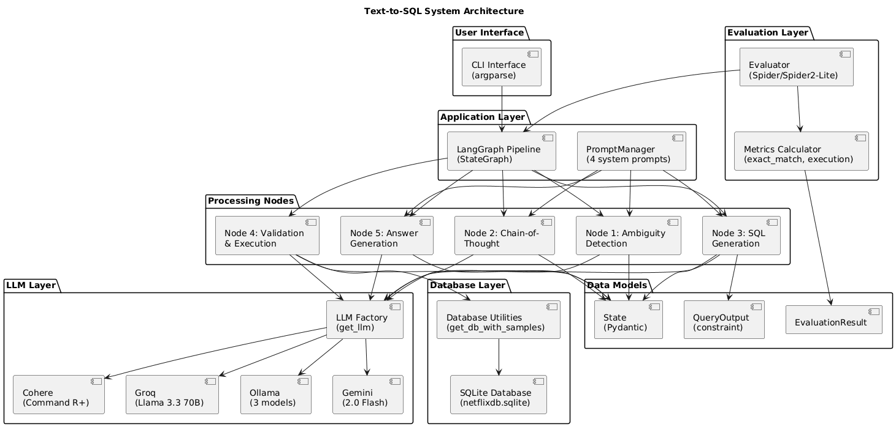
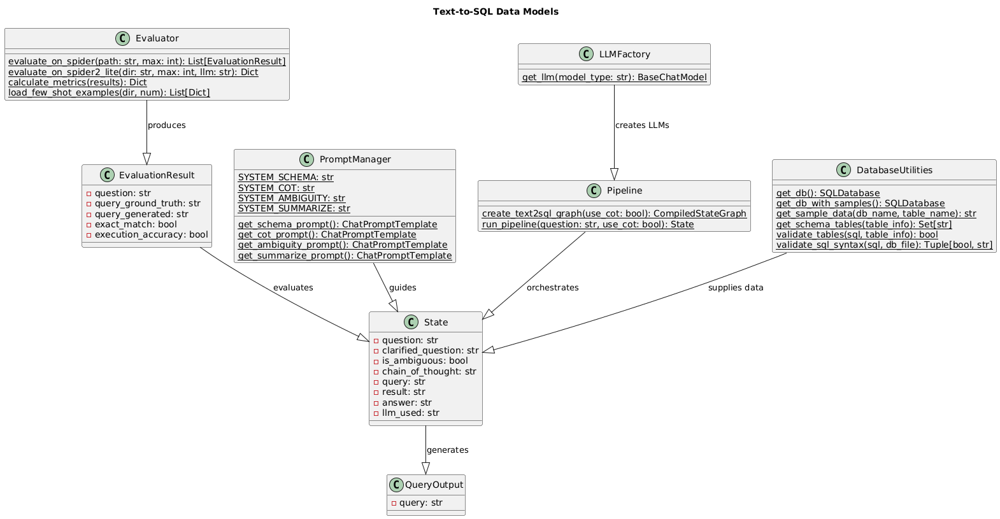
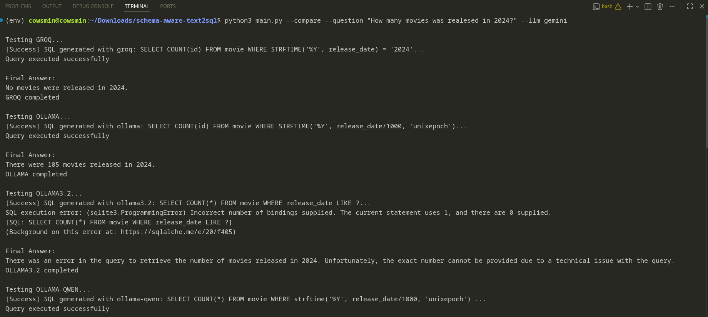
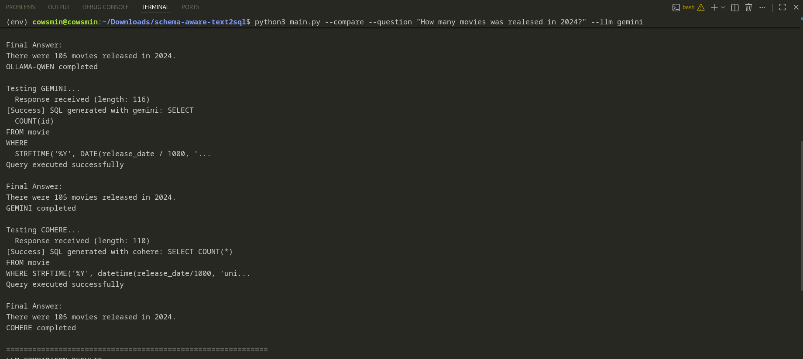
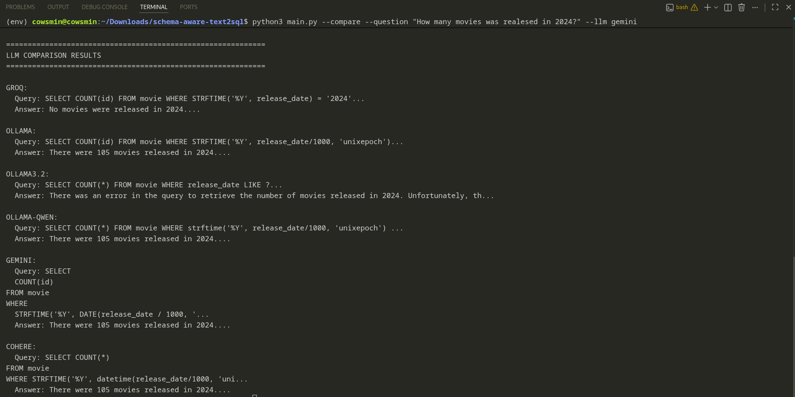
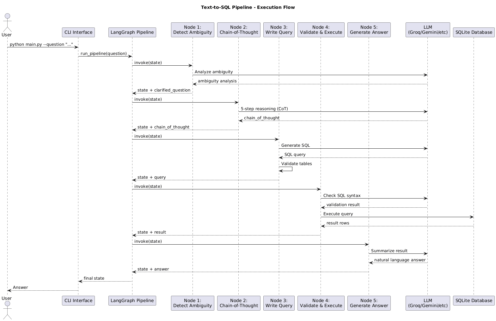
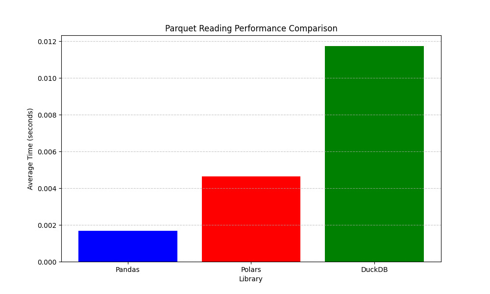

# Schema-Aware Text-to-SQL

A multi-step Text-to-SQL pipeline using LangChain and LangGraph with support for multiple LLMs and Spider benchmark evaluation. 

## Overview

This project provides a complete pipeline for converting natural language questions into SQL queries across different databases without relying on model fine-tuning. The system combines schema-aware prompting, few-shot learning, multi-LLM orchestration, and self-validation to achieve high accuracy at scale. This approach enables effective Text-to-SQL translation without requiring expensive model training or fine-tuning.

## Data Model


## System Arhitecture



## Core Technologies

| Category | Technology | Package/Module | Purpose |
|----------|------------|----------------|---------|
| **LLM Integration** | Groq | `langchain_groq.ChatGroq` | Fast inference with Llama 3.3 70B |
|  | Gemini | `langchain_google_genai.ChatGoogleGenerativeAI` | Google's Gemini 2.0 Flash |
|  | Ollama | `langchain_ollama.ChatOllama` | Local LLM inference (Llama, Qwen) |
|  | Cohere | `langchain_cohere.ChatCohere` | Command-R model |
| **LangChain** | Core | `langchain_core` | Prompts, output parsers |
|  | Community | `langchain_community` | SQL utilities, tools |
|  | LangGraph | `langgraph` | Stateful workflow orchestration |
| **Database** | SQLAlchemy | `sqlalchemy` | Database connections and engines |
|  | SQLite | Built-in | Local database for Spider2-Lite |
|  | SQL Utilities | `langchain_community.utilities.SQLDatabase` | Schema extraction, query execution |
| **Data Processing** | Pydantic | `pydantic` | Data validation and models |
|  | JSON | `json` | Dataset loading and predictions |
|  | Pathlib | `pathlib.Path` | File system operations |
| **Validation** | SQL Checker | `QuerySQLCheckerTool` | SQL syntax validation |
|  | SQLite EXPLAIN | Direct SQLite integration | Query plan verification |
|  | Regex | `re` | SQL cleaning and parsing |
| **Evaluation** | Spider2-Lite | Official evaluation suite | Benchmark testing |
|  | Subprocess | `subprocess` | Running evaluation scripts |
| **Configuration** | Dotenv | `python-dotenv` | Environment variable management |
|  | Argparse | `argparse` | CLI argument parsing |

### Python Dependencies

```bash
pip install -r req.txt
```

or

```bash
pip install \
pandas numpy tqdm pyarrow pathlib \
aiohttp aiofiles beautifulsoup4 \
pillow opencv-python scikit-image matplotlib \
langchain langchain-core langchain-community langchain-experimental \
langchain-openai langchain-groq langchain-ollama \
langchain-cohere langchain-google-genai langgraph \
openai ollama cohere google-generativeai \
psycopg2-binary sqlalchemy sqlparse google-cloud-bigquery \
python-dotenv pydantic
```

### Ollama Setup

If you want to run LLMs locally without API keys or rate limits:

**1. Install Ollama**

```bash
# Linux / WSL
curl -fsSL https://ollama.com/install.sh | sh

```

**2. Pull Required Models**

```bash
ollama pull qwen2.5:7b-instruct

ollama pull llama3.1:8b

ollama pull llama3.2
```

**3. Verify Installation**

```bash
# Check installed models
ollama list

```

## Usage

### Basic Examples
```bash
# Groq (default)
python main.py --question "Your question"

# use Gemini instead
python main.py --question "Your question" --llm gemini

# use local Ollama models
python main.py --question "Your question" --llm ollama-qwen
```

### Compare LLMs
```bash
# compare all available LLMs on same question
python main.py --compare --question "Your question"
```

### Spider2-Lite Evaluation
```bash
# test on 5 examples with Groq
python main.py --spider2-lite ./spider2-lite --max-questions 5
```
## Data Models

The system uses **Pydantic BaseModel** classes to enforce type safety and data validation throughout the pipeline. 


## Execution Screenshots





## Execution Flow


## Why Pandas

Despite Pandas' known limitations with very large datasets, it's ideal for our moderate-sized lists with thousands of entries. The combination of readable code and sufficient performance makes it the optimal choice for this specific data processing task.



## Video Demonstration

[](https://youtu.be/eUc5V2GvTuY)

## Limitations

1. **Database Support**: Currently limited to SQLite (Spider2-Lite subset)
2. **Query Complexity**: Performance degrades on highly complex nested queries
3. **Schema Size**: Large schemas may exceed context window limits
4. **API Dependencies**: Cloud models require stable internet and API keys

## Resources

- [BDNSV](https://github.com/iuliabanu/BDNSV)
- [Spider2](https://github.com/xlang-ai/Spider2)
- [Netflix_db](https://github.com/lerocha/netflixdb)
- [Pandas vs Polars](https://blog.jetbrains.com/pycharm/2024/07/polars-vs-pandas/)
- [Diagrams](https://www.plantuml.com)